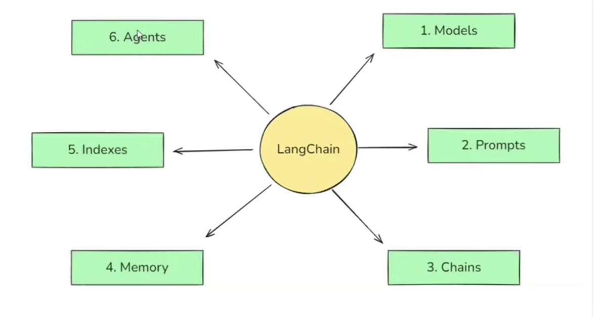

# LangChain Components
   


## 1. What is LangChain?

LangChain is an open-source framework for building applications that use Large Language Models (LLMs).

An LLM by itself can only take text in and give text out. A real application needs more than that. It needs to:

- Send well-structured questions to the model
- Remember earlier messages
- Read your own documents (PDFs, websites, databases)
- Connect several steps together
- Use outside tools such as search, a calculator, or an API

LangChain gives ready-made building blocks for all of this. These blocks are called **components**.

---

## 2. The Six Components

The diagram shows LangChain at the center with six components around it.

| No. | Component | One-line meaning |
|-----|-----------|------------------|
| 1 | Models | The AI brain that reads text and writes text |
| 2 | Prompts | The instructions and questions we send to the model |
| 3 | Chains | Steps joined together in a fixed order |
| 4 | Memory | Storing past messages so the model can remember |
| 5 | Indexes | Preparing your own documents so the model can search them |
| 6 | Agents | A model that decides which tool to use and when |

How they fit together in one simple flow:

```
User question
     |
     v
Prompt (format the question)
     |
     v
Model (generate answer)
     |
     v
Output (final answer)
```

Chains connect these steps. Memory, Indexes, and Agents add extra power on top.

---

## 3. Models

### What it is

The Model component is the interface to the AI model. LangChain gives one common way to call many different providers (OpenAI, Anthropic, Google, and others). If you want to switch from one provider to another, you change very little code.

### Types of models

| Type | Input | Output | Example use |
|------|-------|--------|-------------|
| LLM (text model) | A string | A string | Simple text completion |
| Chat model | A list of messages | A message | Chatbots, assistants |
| Embedding model | Text | A list of numbers (vector) | Search by meaning |

Most modern work uses **chat models** and **embedding models**.

### Example

```python
from langchain_openai import ChatOpenAI

llm = ChatOpenAI(model="gpt-4o-mini")

response = llm.invoke("What is LangChain in one line?")
print(response.content)
```

Row-level view of what happens:

| Step | Value |
|------|-------|
| Input | `"What is LangChain in one line?"` |
| Method called | `invoke` |
| Output | A message object. The text is in `response.content` |

### Key point

`invoke()` is the standard way to run almost every LangChain component.

---

## 4. Prompts

### What it is

A prompt is the text we send to the model. In real applications, the prompt is not fixed. Some parts change every time (like the user's topic). A **prompt template** is a prompt with empty slots that we fill in later.

### Why use templates

- Reuse the same prompt many times
- Avoid mistakes from manual string joining
- Keep instructions in one place

### Example

```python
from langchain_core.prompts import ChatPromptTemplate

prompt = ChatPromptTemplate.from_template(
    "Explain {topic} in simple words for a {level}."
)

filled = prompt.invoke({"topic": "recursion", "level": "beginner"})
print(filled)
```

Row-level view:

| Slot | Value given | Result in prompt |
|------|-------------|------------------|
| `{topic}` | `recursion` | Explain recursion ... |
| `{level}` | `beginner` | ... in simple words for a beginner. |

Final prompt text: `Explain recursion in simple words for a beginner.`

### Message roles in chat prompts

| Role | Purpose |
|------|---------|
| system | Sets the behavior of the model ("You are a helpful teacher") |
| human | The user's message |
| ai | The model's earlier reply |

```python
prompt = ChatPromptTemplate.from_messages([
    ("system", "You are a helpful teacher."),
    ("human", "Explain {topic} simply."),
])
```

---

## 5. Chains

### What it is

A chain joins multiple components so the output of one step becomes the input of the next step. This lets us build a full workflow instead of a single call.

### Example: Prompt, Model, Output Parser

```python
from langchain_core.output_parsers import StrOutputParser

parser = StrOutputParser()

chain = prompt | llm | parser

result = chain.invoke({"topic": "recursion", "level": "beginner"})
print(result)
```

The `|` symbol is the pipe operator. This style is called **LCEL** (LangChain Expression Language).

Row-level view of data moving through the chain:

| Step | Component | Input | Output |
|------|-----------|-------|--------|
| 1 | `prompt` | `{"topic": "recursion", "level": "beginner"}` | Full prompt text |
| 2 | `llm` | Full prompt text | Message object |
| 3 | `parser` | Message object | Plain string |

### Why `StrOutputParser`

The model returns a message object. The parser pulls out only the text, so you get a clean string.

### Chain types you will see

| Type | Meaning |
|------|---------|
| Sequential chain | Steps run one after another |
| Parallel chain | Steps run at the same time on the same input |
| Conditional (router) chain | Chooses a path depending on the input |

---

## 6. Memory

### The problem

LLMs do not remember anything between calls. Each call is independent.

| Call | User says | Model reply without memory |
|------|-----------|----------------------------|
| 1 | My name is Umar. | Nice to meet you, Umar. |
| 2 | What is my name? | I do not know your name. |

### What memory does

Memory stores earlier messages and sends them again with each new question, so the model can use the context.

| Call | User says | Model reply with memory |
|------|-----------|-------------------------|
| 1 | My name is Umar. | Nice to meet you, Umar. |
| 2 | What is my name? | Your name is Umar. |

### Common memory strategies

| Strategy | How it works | Good for |
|----------|--------------|----------|
| Buffer | Keep all messages | Short chats |
| Window | Keep only the last N messages | Controlling cost |
| Summary | Keep a summary of old messages | Long chats |

### Example

```python
from langchain_core.chat_history import InMemoryChatMessageHistory
from langchain_core.runnables.history import RunnableWithMessageHistory
from langchain_core.prompts import ChatPromptTemplate, MessagesPlaceholder

store = {}

def get_history(session_id):
    if session_id not in store:
        store[session_id] = InMemoryChatMessageHistory()
    return store[session_id]

prompt = ChatPromptTemplate.from_messages([
    ("system", "You are a helpful assistant."),
    MessagesPlaceholder("history"),
    ("human", "{input}"),
])

chat = RunnableWithMessageHistory(
    prompt | llm,
    get_history,
    input_messages_key="input",
    history_messages_key="history",
)

config = {"configurable": {"session_id": "user1"}}

chat.invoke({"input": "My name is Umar."}, config=config)
reply = chat.invoke({"input": "What is my name?"}, config=config)
print(reply.content)
```

The `session_id` keeps each user's chat separate.

### Note

In newer LangChain versions, long-term and advanced memory is usually handled with LangGraph. The idea stays the same: store past context and send it back to the model.

---

## 7. Indexes

### The problem

An LLM only knows what it was trained on. It does not know your private PDFs, company notes, or new data. Also, you cannot paste a 200-page document into one prompt.

### What it is

Indexes are the tools that prepare your own data so the model can find the right part quickly. This is the base of **RAG** (Retrieval Augmented Generation).

### The four parts

| Part | Job |
|------|-----|
| Document Loader | Reads data from a source (PDF, web page, CSV) |
| Text Splitter | Cuts large text into small chunks |
| Embeddings + Vector Store | Converts chunks into vectors and stores them |
| Retriever | Finds the chunks most similar to the question |

### Flow

```
PDF -> Loader -> Splitter -> Embeddings -> Vector Store
                                               |
Question -> Retriever <------------------------+
                |
                v
     Relevant chunks + Question -> Model -> Answer
```

### Example

```python
from langchain_community.document_loaders import PyPDFLoader
from langchain_text_splitters import RecursiveCharacterTextSplitter
from langchain_openai import OpenAIEmbeddings
from langchain_community.vectorstores import FAISS

# 1. Load
docs = PyPDFLoader("notes.pdf").load()

# 2. Split
splitter = RecursiveCharacterTextSplitter(chunk_size=500, chunk_overlap=50)
chunks = splitter.split_documents(docs)

# 3. Embed and store
vector_store = FAISS.from_documents(chunks, OpenAIEmbeddings())

# 4. Retrieve
retriever = vector_store.as_retriever(search_kwargs={"k": 3})
results = retriever.invoke("What is a closure?")
```

Row-level view:

| Step | Input | Output |
|------|-------|--------|
| Load | `notes.pdf` (20 pages) | 20 Document objects |
| Split | 20 Documents | About 80 chunks of around 500 characters |
| Embed | 80 chunks | 80 vectors |
| Retrieve | `"What is a closure?"` | The 3 closest chunks |

### Note

In current LangChain docs, this area is mostly described as document loaders, text splitters, vector stores, and retrievers. The older name "Indexes" is what the diagram uses.

---

## 8. Agents

### What it is

A chain follows a fixed path that you design. An **agent** decides the path by itself. The model looks at the question, chooses a tool, uses it, looks at the result, and repeats until it has the final answer.

### Chain vs Agent

| Point | Chain | Agent |
|-------|-------|-------|
| Steps | Fixed by the developer | Chosen by the model |
| Predictability | High | Lower |
| Flexibility | Low | High |
| Best for | Known, repeatable workflows | Open-ended tasks |

### Tools

A tool is a function the agent can call. Examples: web search, calculator, database query, weather API.

```python
from langchain_core.tools import tool

@tool
def multiply(a: int, b: int) -> int:
    """Multiply two numbers."""
    return a * b
```

The docstring matters. The model reads it to understand what the tool does.

### Example

```python
from langchain.agents import create_agent

agent = create_agent(
    model="openai:gpt-4o-mini",
    tools=[multiply],
    system_prompt="You are a helpful assistant.",
)

result = agent.invoke(
    {"messages": [{"role": "user", "content": "What is 23 times 47?"}]}
)
print(result["messages"][-1].content)
```

Row-level view of the agent loop:

| Step | What happens |
|------|--------------|
| 1 | User asks: What is 23 times 47? |
| 2 | Model decides it needs the `multiply` tool |
| 3 | Agent calls `multiply(23, 47)` |
| 4 | Tool returns `1081` |
| 5 | Model writes the final answer using `1081` |

### Note

The agent API changes between LangChain versions. Always check the official documentation for the version you install.

---

## 9. How All Components Work Together

Example: a chatbot that answers questions from your PDF notes.

| Component | Role in this app |
|-----------|------------------|
| Models | Chat model writes the answer, embedding model creates vectors |
| Prompts | Template that holds the question and the retrieved context |
| Indexes | Loads the PDF, splits it, stores vectors, retrieves chunks |
| Chains | Connects retriever, prompt, model, and parser |
| Memory | Remembers earlier questions in the chat |
| Agents | Optional: decides whether to search the PDF, the web, or use a calculator |

---

## 10. Quick Summary

| Component | Remember it as |
|-----------|----------------|
| Models | The brain |
| Prompts | The instructions |
| Chains | The pipeline |
| Memory | The notebook |
| Indexes | The library |
| Agents | The decision maker |

---

## 11. Installation

```bash
pip install langchain langchain-openai langchain-community langchain-text-splitters faiss-cpu pypdf
```

Set your API key before running the examples:

```bash
export OPENAI_API_KEY="your-key-here"
```

---

## 12. Practice Tasks

1. Call a chat model with `invoke()` and print the response.
2. Build a prompt template with two variables and test it with different values.
3. Create a chain using `prompt | llm | parser`.
4. Add memory and confirm the model remembers your name.
5. Load a small PDF, split it, and retrieve the top 3 chunks for a question.
6. Create an agent with one custom tool.

---

## 13. References

- LangChain documentation: https://python.langchain.com
- LangGraph documentation: https://langchain-ai.github.io/langgraph